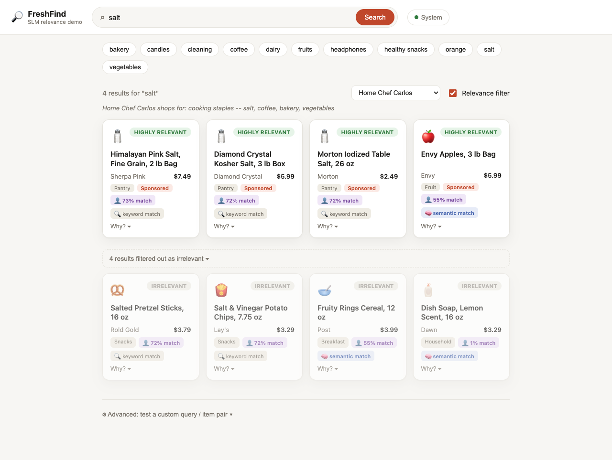

# SLM Relevance

A small-language-model relevance filter for search results and ads, reimplementing the architecture from DoorDash's engineering blog post [*"Using small language models to serve more relevant DoorDash search ads"*](https://careersatdoordash.com/blog/small-language-models-to-serve-more-relevant-doordash-search-ads/) (June 2026) — running entirely on local, open models.


## Overview

Keyword retrieval optimizes for recall and personalization optimizes for engagement — neither guarantees that a candidate result actually matches what a query meant. A search for "salt" will happily surface salt-and-vinegar potato chips, because the keyword overlaps even though the intent doesn't.

DoorDash's fix is a dedicated, user-agnostic **query-item relevance model** that sits ahead of the ad auction and filters out results that are objectively off-target, graded on a 3-level scale:

| Label | Meaning |
|---|---|
| 0 | **Irrelevant** — no meaningful intent match |
| 1 | **Moderately relevant** — an acceptable substitute or secondary intent |
| 2 | **Highly relevant** — a direct hit on the query's intent |

Labeling millions of query-item pairs by hand doesn't scale, so the system uses a **teacher-student split**:

- **Teacher** (offline, large, slow) — an LLM labels query-item pairs in batch, mirroring human judgment.
- **Student** (online, small, fast) — a compact bi-encoder trains on the teacher's labels and serves relevance scores in real time, at the latency budget an ad auction requires.

This project reimplements that architecture end to end, swapping DoorDash's proprietary systems for local, open equivalents — see [Scope and limitations](#scope-and-limitations) for exactly what's a faithful reproduction versus a demo-scale substitute.

## Architecture

| DoorDash's design | This implementation |
|---|---|
| Proprietary 700K-example human-labeled query-item ad corpus | [`data/download_esci.py`](data/download_esci.py) samples the public [Amazon ESCI](https://github.com/amazon-science/esci-data) query-product relevance dataset |
| Fine-tuned closed-source LLM teacher, labeling six months of production traffic offline | [`teacher/label_with_ollama.py`](teacher/label_with_ollama.py) — a local model via [Ollama](https://ollama.com) (default `qwen3:14b`), fully offline. [`teacher/label_with_claude.py`](teacher/label_with_claude.py) is an optional cloud alternative. |
| DistilBERT bi-encoder student — shared encoder weights, CLS pooling, 64-dim projected embeddings, online bilinear scorer | [`model/bi_encoder.py`](model/bi_encoder.py) |
| Cross-entropy vs. CORAL ordinal-regression loss comparison | [`model/coral_loss.py`](model/coral_loss.py), selectable via `--loss` |
| AdamW training with validation-accuracy checkpoint selection | [`model/train.py`](model/train.py) |
| Precision@2 / NDCG@10 evaluation | [`model/evaluate.py`](model/evaluate.py) |
| Offline embedding cache + cheap online scoring, relevance gate ahead of the auction | [`serve/predict.py`](serve/predict.py) (CLI) and [`serve/app.py`](serve/app.py) (web UI) |
| Keyword-based retrieval stage (recall-oriented) ahead of relevance filtering | [`serve/app.py`](serve/app.py)'s `hybrid_retrieve` — keyword matching **plus** dense semantic search ([`retrieval/semantic_retrieve.py`](retrieval/semantic_retrieve.py)), so items with no shared vocabulary (e.g. "cleaning" → "paper towels") aren't invisible before the relevance model gets a chance to judge them |

**Fully local.** The teacher runs against whatever model is already pulled in Ollama; the student (a ~66M-parameter DistilBERT) trains and serves entirely on-device. Nothing in the default configuration calls out to a cloud API.

## Demo

A search-engine-style UI demonstrates the complete funnel — hybrid retrieval followed by relevance filtering — rather than just the model in isolation.

**Relevance filter off** — raw retrieval results, optimized for recall. Every item sharing a word with the query is returned, salt-and-vinegar chips included:


**Relevance filter on** — the trained model scores and reranks the same candidates, moving anything predicted irrelevant into a collapsed section (shown expanded above in the first screenshot).

**Semantic retrieval finding what keyword matching can't** — a dense embedding model runs alongside the keyword matcher, so a query like "cleaning" also surfaces items with no shared vocabulary at all — paper towels, laundry detergent — tagged distinctly so the improvement is visible:


**Comparing student and teacher live** — each result has a "Why?" breakdown showing the small model's score, plus a button to ask the local teacher model for a second opinion on the same pair:


**Picking a persona** re-ranks the relevance-filtered results by simulated engagement (see [Personalization](#personalization-a-second-signal-alongside-relevance) below) without changing which items are eligible in the first place.

Run it with:

```bash
python serve/app.py
# open http://localhost:8000
```

The backend only talks to the local checkpoint file and to `localhost:11434` (Ollama) — no external network calls.

## Setup

```bash
python3.12 -m venv .venv && source .venv/bin/activate
pip install -r requirements.txt

ollama serve            # if not already running
ollama pull qwen3:14b   # or any model you already have
```

## Running the pipeline

```bash
# Smoke test, no model calls at all (heuristic teacher, 1 epoch):
./scripts/run_pipeline.sh --dry-run

# Full local run:
LIMIT=1500 EPOCHS=8 ./scripts/run_pipeline.sh

# With the Claude API as teacher instead:
TEACHER=claude LIMIT=1500 EPOCHS=8 ./scripts/run_pipeline.sh
```

Or step by step:

```bash
python data/download_esci.py --limit 1500
python teacher/label_with_ollama.py --model qwen3:14b --limit 1500
python model/train.py --data data/cache/teacher_labels.jsonl --epochs 8
python serve/predict.py --query "salt" --candidates data/samples/salt_candidates.json
```

## Training data: closing the domain gap

Training on ESCI alone produces a model that behaves inconsistently on the demo catalog — not because ESCI is bad data, but because it's a different style of text: long, specific e-commerce search phrases (*"someday is not a day of the week shirt"*) versus the catalog's short, generic queries (*"salt"*, *"orange"*). Each iteration below was validated against the actual demo catalog, not just the offline metric:

| Attempt | Offline result | Real-world result |
|---|---|---|
| More epochs on the original 800 ESCI pairs | Accuracy plateaued at 75% by epoch 4 | No change — textbook overfitting (train loss → 0, val loss climbing) |
| Synthetic augmentation of the ESCI data ([`data/augment_synthetic.py`](data/augment_synthetic.py)) | Accuracy rose to 87% | No improvement — the validation set was partly grading the synthetic examples' own easiness |
| Real domain-matched data: every query × item pair from the demo catalog, labeled for real by the local teacher ([`data/build_grocery_domain_pairs.py`](data/build_grocery_domain_pairs.py)) | — | Fixed 2 tested categories, broke 4 others entirely — 71 examples across 11 categories was too thin a per-category signal |
| Oversampling the domain-matched examples 8× ([`data/merge_training_data.py`](data/merge_training_data.py)) | 85% accuracy | 10 of 11 categories correct; only individual item-level misses remain |

The 85% figure above turned out to be **inflated by a data leak**: oversampling duplicated rows before the train/validation split, letting identical copies of the same example land on both sides. The honest, leak-free accuracy on the same data is **~75%** — and real-world behavior is no worse than the leaky version, which is the actual point: the inflated number never corresponded to better quality, it just looked better on a metric that was quietly cheating.

The fix — split the unique examples first, then oversample only the training side — is implemented in [`data/merge_training_data.py`](data/merge_training_data.py). [`model/train.py`](model/train.py) honors an explicit `"split"` field per row when present, instead of always re-splitting randomly.

## Retrieval: finding what keyword matching can't

The demo catalog's naive keyword matcher can only find items that share a word stem with the query — "cleaning" never surfaced paper towels, laundry detergent, or dish soap, because none of those titles contain the word "clean." [`retrieval/semantic_retrieve.py`](retrieval/semantic_retrieve.py) adds dense embedding similarity search alongside it, using a general-purpose sentence-embedding model (`all-MiniLM-L6-v2`) rather than the relevance bi-encoder's own embeddings — the bi-encoder was trained through a bilinear scorer, not a contrastive objective, so nothing guarantees its embeddings behave sensibly under plain cosine similarity, which is exactly the property retrieval needs.

The union of both signals ("cleaning" now returns 6 relevant items instead of 2) is a clear net improvement, but it also surfaces a new failure mode worth naming honestly: expanding recall exposes the relevance model to candidate pairs it was never well-calibrated for. On one query, "Envy Apples" — retrieved only via semantic similarity — was scored "highly relevant" for the query "salt," which is wrong. That's not a retrieval bug; it's the relevance model's blind spot becoming visible now that retrieval can actually reach it. Fixing it would mean the same domain-matched-data treatment described above, applied to the newly-expanded candidate pool.

## Real distillation vs. label generation

Everywhere else in this repo, "teacher" is a loose term: the LLM produces a single label per example and is never touched again — the student then trains against that label with ordinary supervised cross-entropy. That's LLM-as-annotator, not knowledge distillation in the technical sense, which normally means training the student against the teacher's *full probability distribution* over the classes (Hinton et al., 2015), not just its top pick.

This repo also implements the real version, kept fully segregated from the rest of the pipeline, to test whether it actually helps here:

- [`teacher/label_with_ollama_soft.py`](teacher/label_with_ollama_soft.py) extracts the teacher's genuine confidence distribution over `{0, 1, 2}` from Ollama's token-level `logprobs` (asking for a bare digit rather than a JSON object, so the very first generated token is the answer), instead of keeping only the winning label.
- [`model/distill_loss.py`](model/distill_loss.py) implements temperature-scaled soft cross-entropy against that distribution.
- [`model/distill_dataset.py`](model/distill_dataset.py) and [`model/train_distill.py`](model/train_distill.py) are separate from the hard-label dataset/training code end to end — nothing shared, so this experiment can't silently affect the deployed pipeline.

**Result: no measurable difference.** Trained on the identical 800 ESCI pairs, a hard-label baseline and the distilled model score identically — **74.38% accuracy each** — when evaluated against the same held-out set and the same ground truth. (Each script's own self-reported number looked different, 74.4% vs. 81.3%, but that gap was an artifact of measuring against two different hard-label sources that only agreed with each other 89% of the time — not a real result. Comparing both checkpoints against one consistent ground truth erased it entirely.)

The reason is visible before training even starts: the teacher's mean confidence in its top answer is **98.8%**, with only 4 of 800 examples showing genuine uncertainty (max probability under 60%). Distillation's entire value proposition is learning from a teacher's *doubt* — which classes it considered and rejected, not just the one it picked. A teacher that's almost never in doubt has nothing extra to distill; soft-label training degenerates to hard-label training in all but a handful of examples.

Two natural follow-ups to that conclusion, both tested rather than assumed:

- **Raising the distillation temperature to flatten the teacher's already-peaked distribution further** (`--temperature 5.0`, up from the default 2.0) didn't help either — 75.0% vs. the baseline's 74.4%, a one-example difference on 160 held-out examples, i.e. noise.
- **Swapping the teacher for `llama3:8b`**, a smaller, differently-calibrated model, produced a genuinely less confident teacher (mean top-probability **78.8%**, with 168 of 800 examples — 21% — showing real uncertainty, vs. qwen3's 4). Training a matched hard-label baseline and a distilled model on this teacher's labels still lands on the *same* overall accuracy (67.5% both) — but this time the tie isn't for lack of a difference: the per-class breakdown shows the distilled model trading accuracy on classes 0/1 for a real gain on class 2 (58/70 correct vs. 49/70), i.e. it learned to call things "highly relevant" more often, a direct effect of soft labels giving partial credit toward class 2 on examples the teacher wasn't fully committed to 0 or 1. The two models are not identical — they just make a different trade that happens to net out to the same score.

Net conclusion: real distillation changes *what kind of mistakes* the model makes when the teacher has genuine uncertainty to offer, but doesn't move overall accuracy in either configuration tested. Whether that trade (fewer 0/1 misses, more confident 2 calls) is actually preferable depends on which error type costs more in the product it's serving — accuracy alone doesn't settle it.

## Personalization: a second signal alongside relevance

Everything above is deliberately **user-agnostic** — the relevance model answers "does this item match the query's intent," the same answer for every user, which is the whole point of separating it from personalization in the first place (the blog's own framing: keyword-driven personalization alone can't fix a relevance problem, since amplifying a user's existing preferences just amplifies bad keyword matches too). Personalization is a second, independent signal that runs in parallel and only affects *ranking* among results relevance already approved — never what's eligible in the first place.

[`personalization/`](personalization/) implements this as its own small model, since there's no real user or interaction data to learn from here:

- [`personalization/simulate_users.py`](personalization/simulate_users.py) hand-authors 6 personas (e.g. "Tech Enthusiast Tariq: headphones and electronics, barely shops groceries") as category-preference and price-sensitivity vectors, then simulates noisy engagement ("would this persona click this item?") across the whole catalog — a labeled dataset to train against, standing in for real clickstream data. **This is the load-bearing honesty point of the whole feature**: every number downstream is only as real as these hand-authored personas, not evidence about actual user behavior.
- [`personalization/model.py`](personalization/model.py) is a small two-tower model — a learned embedding per persona (standard collaborative-filtering style, since there's no natural-language description of a user the way there is a search query) combined with an item feature vector (category + normalized price) via dot product — trained with plain binary cross-entropy on the simulated interactions ([`personalization/train.py`](personalization/train.py)).
- `serve/app.py`'s `/api/search` takes an optional `persona`: relevance still decides which items are eligible (`kept`), exactly as before; personalization only re-sorts within that eligible set.

```bash
python personalization/simulate_users.py   # regenerate the simulated interaction data
python personalization/train.py            # retrain -> checkpoints/personalization.pt
```

The trained model recovers each hand-authored persona's preferences cleanly — querying it directly gives Tariq 98.8% predicted engagement on wireless headphones and 0.7% on birthday candles, matching the intended design. In the running app, switching personas for the same query visibly re-ranks the same relevant results and changes the "match %" badge substantially (a "salt" search shows Home Chef Carlos at 72–73% match on real salt products, Tech Enthusiast Tariq at 1–2% on the identical items) — while the *set* of results stays exactly what relevance already approved:



## Closing the fine-tuned-teacher gap

DoorDash's own pipeline for *creating* the teacher looks like this: write a rubric, sample some unlabeled data, have **humans label a seed set** against the rubric, then **fine-tune** a pretrained LLM on that seed set to get the relevance-judging teacher. Every teacher script elsewhere in this repo skips that entirely — `teacher/label_with_ollama.py` and friends just hand a pretrained model the rubric as a *prompt* at inference time and trust its zero-shot judgment. That gap was already named in "Scope and limitations" below; this closes it, honestly rather than by assumption.

- [`data/seed_labels_claude.jsonl`](data/seed_labels_claude.jsonl) is the seed set: 155 query-item pairs, each read and graded against the exact same 0/1/2 rubric by Claude directly — **not independent human raters**. Say that plainly every time this is referenced: an LLM grading examples to fine-tune another LLM doesn't carry DoorDash's actual evidentiary weight (they validated their teacher against 700K *human* labels at 86% accuracy before trusting it). This stands in for that step; it doesn't replicate it.
- [`teacher/fine_tune_teacher.py`](teacher/fine_tune_teacher.py) LoRA-fine-tunes `Qwen2.5-0.5B-Instruct` (small, ungated, Apache 2.0) on 124 of those examples to predict a bare 0/1/2 digit, holding out 31 for evaluation.

**Result: zero-shot accuracy on the held-out set was 29.0% — fine-tuned, 54.8%.** An earlier pass at this with only 48 seed examples (39 train / 9 held out) reported a much more dramatic 0% → 55.6% — worth correcting rather than leaving on record: with just 9 held-out examples, the base model getting *all* of them wrong isn't strong evidence it's *always* wrong, it's a believable unlucky draw from a model that's genuinely bad but not literally at 0%. Scaling to 155 examples (31 held out) gives a materially more trustworthy zero-shot estimate, and it's notably less dramatic — closer to random chance (33% for 3 classes) than to zero. What held up across both runs: the fine-tuned accuracy landed in almost the same place both times (55.6% vs. 54.8%), suggesting that number is fairly stable while the *zero-shot* estimate was the one small-sample noise was distorting. The corrected, honest headline: fine-tuning on this seed set takes zero-shot judgment from roughly chance-level to clearly, reliably better than chance — a real effect, just a more moderate one than the small-sample run first suggested.

The honest limits: 155 examples (124 train, 31 held out) is still a small sample by any standard, and the seed labels are still Claude's judgment, not ground truth — this demonstrates that the fine-tuning mechanism works, not what accuracy a real fine-tuned teacher would reach at DoorDash's scale.

## Scope and limitations

This is a from-scratch reimplementation of DoorDash's *architecture*, not their system or data — trained on thousands of examples on a single machine, not the hundreds of thousands to millions DoorDash used across distributed infrastructure. Several shortcuts here would need to be addressed before anything like this reached production:

- **The production teacher's labels are still unvalidated against real human judgment.** The "Closing the fine-tuned-teacher gap" section above demonstrates the *mechanism* DoorDash uses (fine-tune on a human-labeled seed set) but the 155-example seed set is Claude's own judgment, not independent human raters — DoorDash validated their teacher against 700K real human labels (86% accuracy) before trusting it at scale. That's still the gap between this repo and production-grade trust in the labels.
- **No held-out test set independent of the tuning loop.** Every dataset here doubled as both what was tuned against and what was reported. Production evaluation needs a test set that's never touched during iteration, plus live A/B testing — offline accuracy is a proxy, not the real quality bar.
- **Single-run results, no variance estimate.** At this data scale, metrics swing meaningfully between runs; a single seed isn't enough to trust a delta between two approaches.
- **Dataset scale.** ~1,600 training examples versus DoorDash's 700K+ human-labeled pairs and six months of production traffic.
- **Personalization runs entirely on simulated users.** There's no real interaction data anywhere in this project; the personas and their "engagement" are hand-authored, not observed. The model architecture and its ranking behavior are real — what it's ranking *for* is not.

## Repo layout

```
data/download_esci.py               sample public ESCI query-item pairs
data/build_grocery_domain_pairs.py  generate demo-catalog-style query x item pairs
data/merge_training_data.py         leakage-safe merge + oversampling of ESCI + domain-matched data
data/augment_synthetic.py           label-preserving text perturbation (see "Training data" above)
teacher/label_with_ollama.py        LLM teacher (local, default): batch-labels pairs via Ollama
teacher/label_with_claude.py        LLM teacher (cloud, optional): same rubric via the Claude API
teacher/label_with_ollama_soft.py   soft-label teacher: extracts the teacher's full confidence distribution
teacher/fine_tune_teacher.py        LoRA fine-tunes a small LLM on the seed set (closes the fine-tuned-teacher gap)
data/sample_seed_candidates.py      samples the pairs data/build_seed_labels.py's judgments are keyed to (batch 1, 48)
data/build_seed_labels.py           writes the batch-1 seed labels from hand-graded judgments
data/sample_seed_candidates_batch2.py  samples more pairs, excluding what's already labeled (batch 2, 107)
data/build_seed_labels_batch2.py    writes the batch-2 seed labels, scaling the seed set to 155 total
data/seed_labels_claude.jsonl       the 155-example seed set itself (Claude-labeled, not human -- see above)
model/bi_encoder.py                 DistilBERT bi-encoder student
model/coral_loss.py                 CORAL ordinal-regression loss + head
model/dataset.py                    tokenization / batching
model/train.py                      training loop (hard labels)
model/distill_dataset.py            dataset for soft-label training
model/distill_loss.py               temperature-scaled distillation loss
model/train_distill.py              training loop (real distillation, segregated from model/train.py)
model/evaluate.py                   accuracy, Precision@2, NDCG@10
retrieval/semantic_retrieve.py      dense embedding retrieval (Stage 1, alongside keyword matching)
personalization/simulate_users.py   hand-authored personas + simulated engagement data
personalization/model.py            two-tower persona/item engagement model
personalization/train.py            training loop
serve/predict.py                    CLI: cached-embedding scoring + relevance gate
serve/app.py                        web UI backend (FastAPI)
serve/static/                       web UI frontend (HTML/CSS/JS)
scripts/run_pipeline.sh             end-to-end orchestration
docs/screenshots/capture.py         regenerates the screenshots in this README
```

## Extending this

- Swap `data/download_esci.py` for your own query-item corpus — the teacher only needs `{query, item_text}` pairs, not pre-existing labels.
- `model/train.py` runs on a single device (CUDA/MPS/CPU auto-detected); wrapping the model in `torch.nn.parallel.DistributedDataParallel` is the only change needed to go multi-GPU.
- Swap in a different Ollama model via `--model` on `teacher/label_with_ollama.py` to trade teacher quality for labeling speed.
