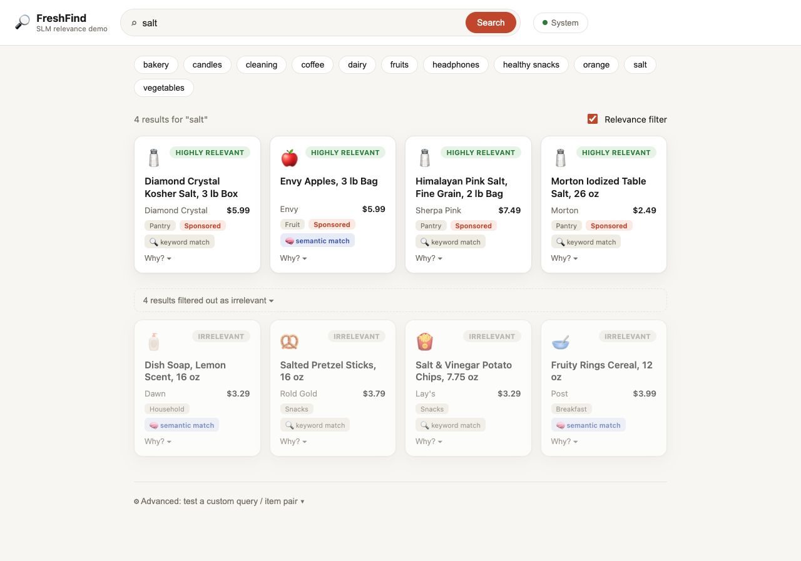
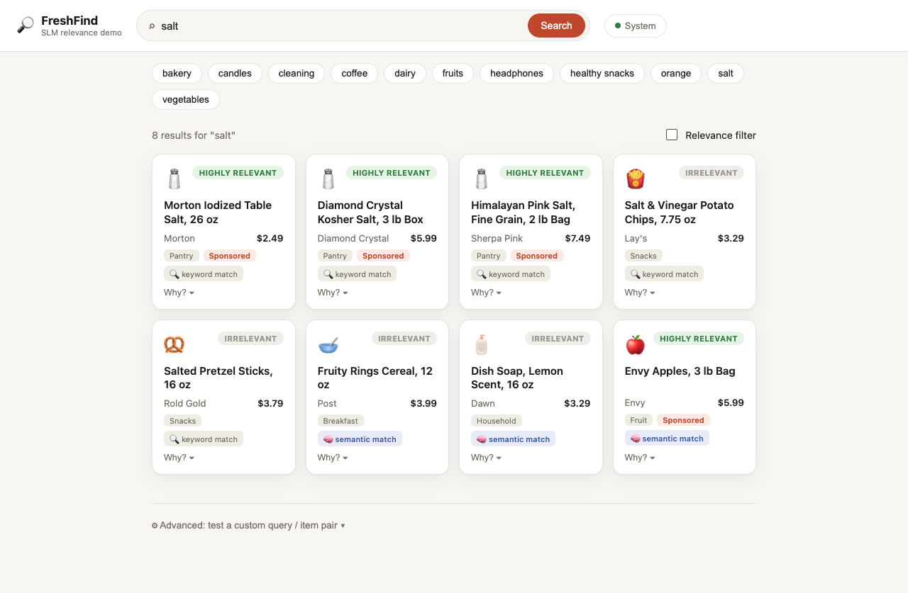
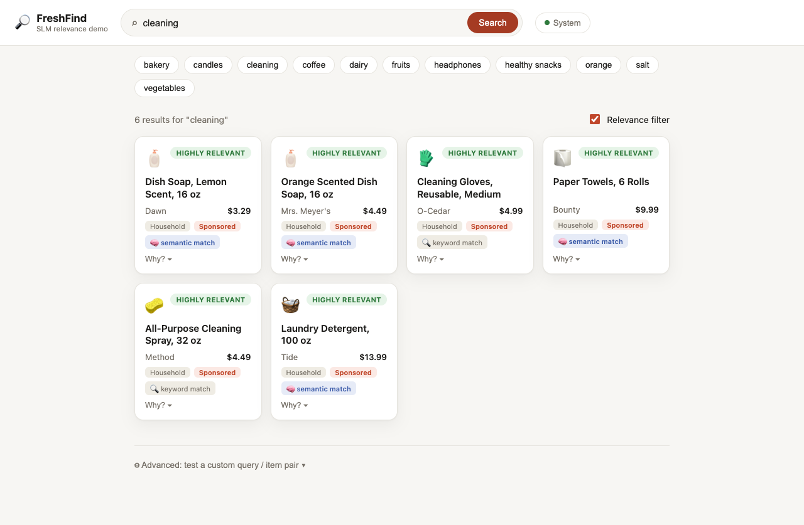
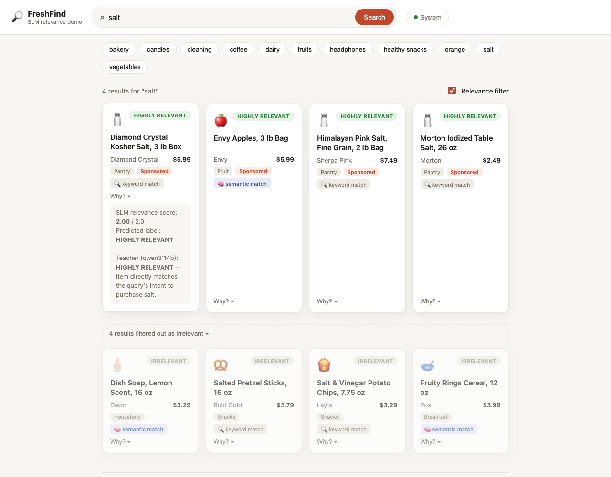

# SLM Relevance

A small-language-model relevance filter for search results and ads, reimplementing the architecture from DoorDash's engineering blog post [*"Using small language models to serve more relevant DoorDash search ads"*](https://careersatdoordash.com/blog/small-language-models-to-serve-more-relevant-doordash-search-ads/) (June 2026) — running entirely on local, open models.



## Overview

Keyword retrieval optimizes for recall and personalization optimizes for engagement — neither guarantees that a candidate result actually matches what a query meant. A search for "salt" will happily surface salt-and-vinegar potato chips, because the keyword overlaps even though the intent doesn't.

DoorDash's fix is a dedicated, user-agnostic **query-item relevance model** that sits ahead of the ad auction and filters out results that are objectively off-target, graded on a 3-level scale:

| Label | Meaning |
|---|---|
| 0 | **Irrelevant** — no meaningful intent match |
| 1 | **Moderately relevant** — an acceptable substitute or secondary intent |
| 2 | **Highly relevant** — a direct hit on the query's intent |

Labeling millions of query-item pairs by hand doesn't scale, so the system uses a **teacher-student split**:

- **Teacher** (offline, large, slow) — an LLM labels query-item pairs in batch, mirroring human judgment.
- **Student** (online, small, fast) — a compact bi-encoder trains on the teacher's labels and serves relevance scores in real time, at the latency budget an ad auction requires.

This project reimplements that architecture end to end, swapping DoorDash's proprietary systems for local, open equivalents — see [Scope and limitations](#scope-and-limitations) for exactly what's a faithful reproduction versus a demo-scale substitute.

## Architecture

| DoorDash's design | This implementation |
|---|---|
| Proprietary 700K-example human-labeled query-item ad corpus | [`data/download_esci.py`](data/download_esci.py) samples the public [Amazon ESCI](https://github.com/amazon-science/esci-data) query-product relevance dataset |
| Fine-tuned closed-source LLM teacher, labeling six months of production traffic offline | [`teacher/label_with_ollama.py`](teacher/label_with_ollama.py) — a local model via [Ollama](https://ollama.com) (default `qwen3:14b`), fully offline. [`teacher/label_with_claude.py`](teacher/label_with_claude.py) is an optional cloud alternative. |
| DistilBERT bi-encoder student — shared encoder weights, CLS pooling, 64-dim projected embeddings, online bilinear scorer | [`model/bi_encoder.py`](model/bi_encoder.py) |
| Cross-entropy vs. CORAL ordinal-regression loss comparison | [`model/coral_loss.py`](model/coral_loss.py), selectable via `--loss` |
| AdamW training with validation-accuracy checkpoint selection | [`model/train.py`](model/train.py) |
| Precision@2 / NDCG@10 evaluation | [`model/evaluate.py`](model/evaluate.py) |
| Offline embedding cache + cheap online scoring, relevance gate ahead of the auction | [`serve/predict.py`](serve/predict.py) (CLI) and [`serve/app.py`](serve/app.py) (web UI) |
| Keyword-based retrieval stage (recall-oriented) ahead of relevance filtering | [`serve/app.py`](serve/app.py)'s `hybrid_retrieve` — keyword matching **plus** dense semantic search ([`retrieval/semantic_retrieve.py`](retrieval/semantic_retrieve.py)), so items with no shared vocabulary (e.g. "cleaning" → "paper towels") aren't invisible before the relevance model gets a chance to judge them |

**Fully local.** The teacher runs against whatever model is already pulled in Ollama; the student (a ~66M-parameter DistilBERT) trains and serves entirely on-device. Nothing in the default configuration calls out to a cloud API.

## Demo

A search-engine-style UI demonstrates the complete funnel — hybrid retrieval followed by relevance filtering — rather than just the model in isolation.

**Relevance filter off** — raw retrieval results, optimized for recall. Every item sharing a word with the query is returned, salt-and-vinegar chips included:



**Relevance filter on** — the trained model scores and reranks the same candidates, moving anything predicted irrelevant into a collapsed section (shown expanded above in the first screenshot).

**Semantic retrieval finding what keyword matching can't** — a dense embedding model runs alongside the keyword matcher, so a query like "cleaning" also surfaces items with no shared vocabulary at all — paper towels, laundry detergent — tagged distinctly so the improvement is visible:



**Comparing student and teacher live** — each result has a "Why?" breakdown showing the small model's score, plus a button to ask the local teacher model for a second opinion on the same pair:



Run it with:

```bash
python serve/app.py
# open http://localhost:8000
```

The backend only talks to the local checkpoint file and to `localhost:11434` (Ollama) — no external network calls.

## Setup

```bash
python3.12 -m venv .venv && source .venv/bin/activate
pip install -r requirements.txt

ollama serve            # if not already running
ollama pull qwen3:14b   # or any model you already have
```

## Running the pipeline

```bash
# Smoke test, no model calls at all (heuristic teacher, 1 epoch):
./scripts/run_pipeline.sh --dry-run

# Full local run:
LIMIT=1500 EPOCHS=8 ./scripts/run_pipeline.sh

# With the Claude API as teacher instead:
TEACHER=claude LIMIT=1500 EPOCHS=8 ./scripts/run_pipeline.sh
```

Or step by step:

```bash
python data/download_esci.py --limit 1500
python teacher/label_with_ollama.py --model qwen3:14b --limit 1500
python model/train.py --data data/cache/teacher_labels.jsonl --epochs 8
python serve/predict.py --query "salt" --candidates data/samples/salt_candidates.json
```

## Training data: closing the domain gap

Training on ESCI alone produces a model that behaves inconsistently on the demo catalog — not because ESCI is bad data, but because it's a different style of text: long, specific e-commerce search phrases (*"someday is not a day of the week shirt"*) versus the catalog's short, generic queries (*"salt"*, *"orange"*). Each iteration below was validated against the actual demo catalog, not just the offline metric:

| Attempt | Offline result | Real-world result |
|---|---|---|
| More epochs on the original 800 ESCI pairs | Accuracy plateaued at 75% by epoch 4 | No change — textbook overfitting (train loss → 0, val loss climbing) |
| Synthetic augmentation of the ESCI data ([`data/augment_synthetic.py`](data/augment_synthetic.py)) | Accuracy rose to 87% | No improvement — the validation set was partly grading the synthetic examples' own easiness |
| Real domain-matched data: every query × item pair from the demo catalog, labeled for real by the local teacher ([`data/build_grocery_domain_pairs.py`](data/build_grocery_domain_pairs.py)) | — | Fixed 2 tested categories, broke 4 others entirely — 71 examples across 11 categories was too thin a per-category signal |
| Oversampling the domain-matched examples 8× ([`data/merge_training_data.py`](data/merge_training_data.py)) | 85% accuracy | 10 of 11 categories correct; only individual item-level misses remain |

The 85% figure above turned out to be **inflated by a data leak**: oversampling duplicated rows before the train/validation split, letting identical copies of the same example land on both sides. The honest, leak-free accuracy on the same data is **~75%** — and real-world behavior is no worse than the leaky version, which is the actual point: the inflated number never corresponded to better quality, it just looked better on a metric that was quietly cheating.

The fix — split the unique examples first, then oversample only the training side — is implemented in [`data/merge_training_data.py`](data/merge_training_data.py). [`model/train.py`](model/train.py) honors an explicit `"split"` field per row when present, instead of always re-splitting randomly.

## Retrieval: finding what keyword matching can't

The demo catalog's naive keyword matcher can only find items that share a word stem with the query — "cleaning" never surfaced paper towels, laundry detergent, or dish soap, because none of those titles contain the word "clean." [`retrieval/semantic_retrieve.py`](retrieval/semantic_retrieve.py) adds dense embedding similarity search alongside it, using a general-purpose sentence-embedding model (`all-MiniLM-L6-v2`) rather than the relevance bi-encoder's own embeddings — the bi-encoder was trained through a bilinear scorer, not a contrastive objective, so nothing guarantees its embeddings behave sensibly under plain cosine similarity, which is exactly the property retrieval needs.

The union of both signals ("cleaning" now returns 6 relevant items instead of 2) is a clear net improvement, but it also surfaces a new failure mode worth naming honestly: expanding recall exposes the relevance model to candidate pairs it was never well-calibrated for. On one query, "Envy Apples" — retrieved only via semantic similarity — was scored "highly relevant" for the query "salt," which is wrong. That's not a retrieval bug; it's the relevance model's blind spot becoming visible now that retrieval can actually reach it. Fixing it would mean the same domain-matched-data treatment described above, applied to the newly-expanded candidate pool.

## Scope and limitations

This is a from-scratch reimplementation of DoorDash's *architecture*, not their system or data — trained on thousands of examples on a single machine, not the hundreds of thousands to millions DoorDash used across distributed infrastructure. Several shortcuts here would need to be addressed before anything like this reached production:

- **The teacher's labels are unvalidated against human judgment.** We checked agreement against ESCI's own reference labels (50%) but never against real human raters. DoorDash validated their teacher against 700K human labels (86% accuracy) *before* trusting it at scale — that step is what makes the whole approach trustworthy, and it's skipped here.
- **No held-out test set independent of the tuning loop.** Every dataset here doubled as both what was tuned against and what was reported. Production evaluation needs a test set that's never touched during iteration, plus live A/B testing — offline accuracy is a proxy, not the real quality bar.
- **Single-run results, no variance estimate.** At this data scale, metrics swing meaningfully between runs; a single seed isn't enough to trust a delta between two approaches.
- **Dataset scale.** ~1,600 training examples versus DoorDash's 700K+ human-labeled pairs and six months of production traffic.

## Repo layout

```
data/download_esci.py               sample public ESCI query-item pairs
data/build_grocery_domain_pairs.py  generate demo-catalog-style query x item pairs
data/merge_training_data.py         leakage-safe merge + oversampling of ESCI + domain-matched data
data/augment_synthetic.py           label-preserving text perturbation (see "Training data" above)
teacher/label_with_ollama.py        LLM teacher (local, default): batch-labels pairs via Ollama
teacher/label_with_claude.py        LLM teacher (cloud, optional): same rubric via the Claude API
model/bi_encoder.py                 DistilBERT bi-encoder student
model/coral_loss.py                 CORAL ordinal-regression loss + head
model/dataset.py                    tokenization / batching
model/train.py                      training loop
model/evaluate.py                   accuracy, Precision@2, NDCG@10
retrieval/semantic_retrieve.py      dense embedding retrieval (Stage 1, alongside keyword matching)
serve/predict.py                    CLI: cached-embedding scoring + relevance gate
serve/app.py                        web UI backend (FastAPI)
serve/static/                       web UI frontend (HTML/CSS/JS)
scripts/run_pipeline.sh             end-to-end orchestration
docs/screenshots/capture.py         regenerates the screenshots in this README
```

## Extending this

- Swap `data/download_esci.py` for your own query-item corpus — the teacher only needs `{query, item_text}` pairs, not pre-existing labels.
- `model/train.py` runs on a single device (CUDA/MPS/CPU auto-detected); wrapping the model in `torch.nn.parallel.DistributedDataParallel` is the only change needed to go multi-GPU.
- Swap in a different Ollama model via `--model` on `teacher/label_with_ollama.py` to trade teacher quality for labeling speed.
